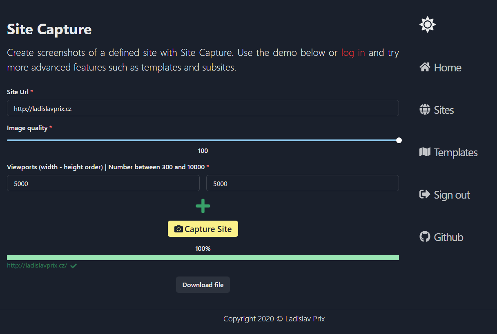

# Site Capture

Application for capturing screenshots of defined sites using predefined parameters. Application supporting templates for shared definitions of quality, viewports, etc...

## Application Parts

The frontend can be found in [Site Capture Next](https://github.com/prixladi/site-capture-next) repository. 
The backend can be found in [Site Capture Server](https://github.com/prixladi/site-capture-server) repository. 
The worker can be found in [Site Capture Puppet](https://github.com/prixladi/site-capture-puppet) repository. 
Application is using [Shamyr Authority](https://github.com/prixladi/shamyr-cloud-authority) as an identity provider.

## Docker

### `docker-compose up`

Runs production-ready containers with the configuration specified in [/docker-compose.yml](docker-compose.yml).

## Images from app

